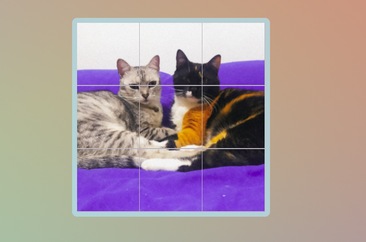

# PUZZLE CAT

This is a puzzle of my two cats
This puzzle is made with CSS, HTML and JavaScript

### Things I learned 
* How to use while and for Loop to iterate and obtain  array images
* How to implement in funny ways Drag and Drop 
* How to use javascript logic to play with the images

## Contact :fax:

* GitHub [@susird](https://github.com/SUSIRD)
* Twitter [@ve5pula](https://twitter.com/ve5pula)
* Linkedin [susana-rd](https://www.linkedin.com/in/susana-rd/)